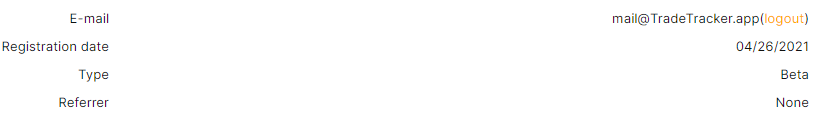
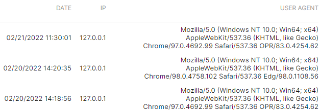
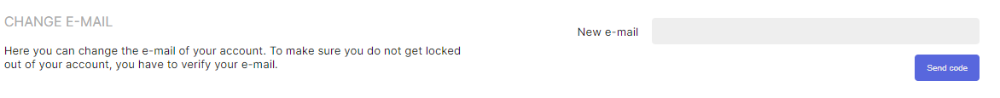
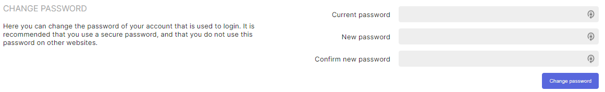

# Account management

## Information

### General 
General account information.

### Last logins
An overview of the last logins onto the account, ordered by `Date`, `IP` and `User-Agent`.

## Change credentials

### Change E-Mail
Here you can change the e-mail of your account. To make sure you do not get locked out of your account, you have to verify your e-mail.

### Change Password
Here you can change the password of your account that is used to login. It is recommended to use a strong and unique password.

