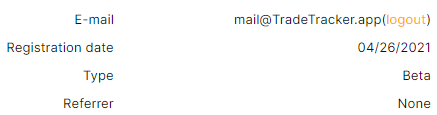
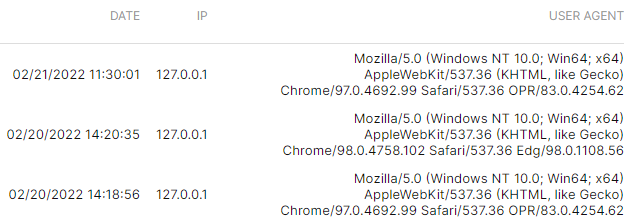
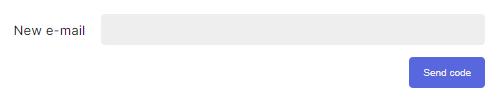
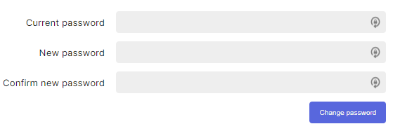

# Account management
On the Account Management page you can find general information about your account and or change login credentials.

By clicking on your username on the top-right of the app, you will be forwarded to the Account settings.

### Account information
General account information.

### Last logins
An overview of the last logins onto the account, ordered by `Date`, `IP` and `User-Agent`.

### E-Mail
Here you can change the e-mail of your account. To make sure you do not get locked out of your account, you have to verify your e-mail.

### Password
Here you can change the password of your account that is used to login. It is recommended to use a strong and unique password.

