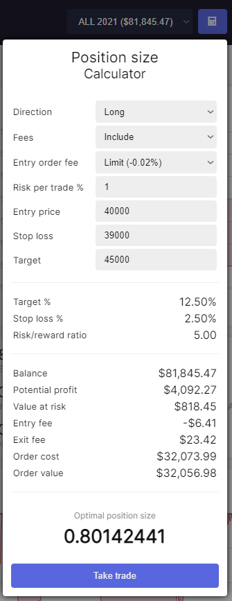

# Position size calculator
Have you ever asked yourself what your position size should be if you have an entry, stoploss, and a maximum amount of risk you want to take?

Our position size calculator will answer that question for you. If you have created a trade plan and have an entry, target, and stop loss, your optimal position size will be calculated automatically based on how much risk you are willing to take.

## Calculator
The position size calculator can be found under the calculator icon on the top-right of our app, next to your username.

After clicking take trade, all the variables such as `Entry`, `exit`, `stoploss` and `target` price will be forwarded to the trade setup page.
 
### Variables
Variables to type in:

|Variable|Description|
|--|--|
|Direction|The direction of the trade, either `LONG` or `SHORT`.|
|Fees|Includes fee calculations and subtract these from the position size. The percentage is retrieved from the defined fee in the portfolio.|
|Risk %|Percentage of the portfolio that is lost after the position is stopped out (excl. slippage).|
|Entry|Price at which the position is purchased.|
|Stop loss|Price at which the position should be exited when the trade turns out to be a loss.|
|Target|Price at which you intent to take profit.|

### Calculations
Based on the provided variables, the following values are calculated:

|Calculation|Description|
|--|--|
|Target %|The distance between the entry and the target price in percentage.|
|Stop loss%|The distance between the entry and the stoploss price in percentage.|
|Value at risk|The amount that is lost after the position is stopped out (excl. slippage).|
|Entry fee|The amount of fee that is paid to open the position.|
|Exit fee|The amount of fee that is paiid to cover the position with a stop loss (excl. slippage). For this instance, the fee is always based on a market-order.|
|Order cost|The value of the position plus the fee that is paid to open the position.|
|Order value|The value of the position.|

