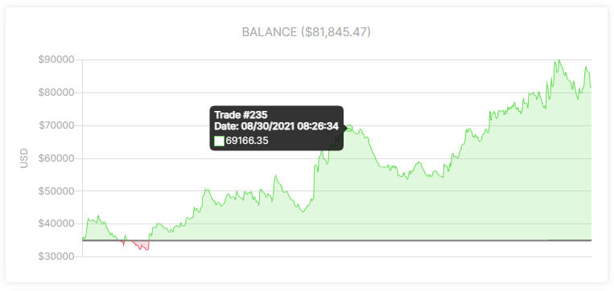

# Dashboard

The dashboard page is an information managment tool that visually tracks, analyzes and displays your key performance. It is connected to all your trade data in the form of line and bar charts. A dashboard is the most efficient way to keep track of your trades, because it provides a central location to monitor and analyze your performance.

It is designed so that it answers important questions about your trading, for quick analysis and informational awareness. It is meant to help you getting insight and awareness in your trading performance. This can help immensely with decision making, trade execution, setting targets and help you understand why some things dont work at all, so that you can make the appropriate changes to make it work and have realistic future goals.

The dashboard works very straightforward. Below is a summary of what it provides.

# Line charts
## Balance
Line balance chart includes all transactions, including deposits & withdrawals.

## Cumulative PNL %
Line chart includes all your trades PNL in percentage, adjusted to your total deposits.

## Drawdown %
Line chart that displays the amount of drawdown you have had in percentage.
