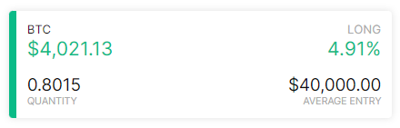
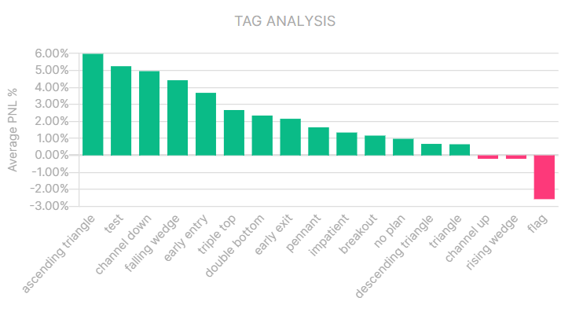
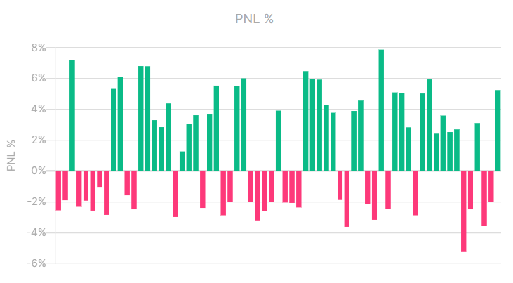
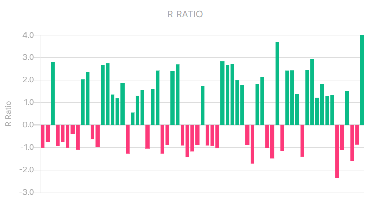

# Dashboard
The dashboard page is an information managment tool that visually tracks, analyzes and displays your key performance indicators. It is connected to all your trade data in the form of line and bar charts. A dashboard is the most efficient way to keep track of your trades, because it provides a central location to monitor and analyze your performance.

It is designed so that it answers important questions about your trading, for quick analysis and informational awareness. It is meant to help you getting insight and awareness in your trading performance. This can help immensely with decision making, trade execution, setting targets and help you understand why some things dont work at all, so that you can make the appropriate changes to make it work and have realistic future goals.

The dashboard works very straightforward. Below is a summary of the data that is provided on the dashboard.

### Open positions
When having open positions, cards will be shown on the top of the dashboard with live P/L, provided by the price ticker-api from the exchange.

### Balance
The balance chart illustrates all transactions of the portfolio, including trades, deposits, withdrawals. The low-point of this chart starts at the value of the first deposit transaction and will color green above and red below this low-point.

### Tags
Tags can be added to trades at the trade setup page. This chart illustrates the average PNL% of each tag label.

### General data

|Value|Description|
|--|--|
|Average Profit|Description|
|Average Loss|Description|
|Profit Factor|Description|
|Value|Description|
|--|--|
|Winning Longs|Description|
|Winning Shorts|Description|
|Win Ratio|Description|

|Value|Description|
|--|--|
|Balance|Description|
|Total Return|Description|
|Unrealized|Description|
|Deposited|Description|
|Daily rate of return|Description|
|Withdrawn|Description|
|Value|Description|
|--|--|
|Largest winner|Description|
|Largest Loser|Description|
|Maximum Drawdown|Description|
|Avg. holding time|Description|
|Average R|Description|
|Average Risk %|Description|

### Cumulative PNL %
Line chart includes all your trades PNL in percentage, adjusted to your total deposits.

### Drawdown %
Line chart that displays the amount of drawdown you have had in percentage.

### PNL %
Bar chart that displays your trades PNL in percentage per trade.

#### Risk %
Bar chart that displays the risk you took in percentage per trade.

### R Ratio
Bar chart that displays the Risk/Reward ratio per trade.

### PNL %
This bar chart displays the sum of all your trades PNL per day combined in percentage.

### PNL
This bar chart displays the sum of all your trades PNL per day combined.

### R Ratio
Bar chart that displays the Risk/Reward combined per day.

