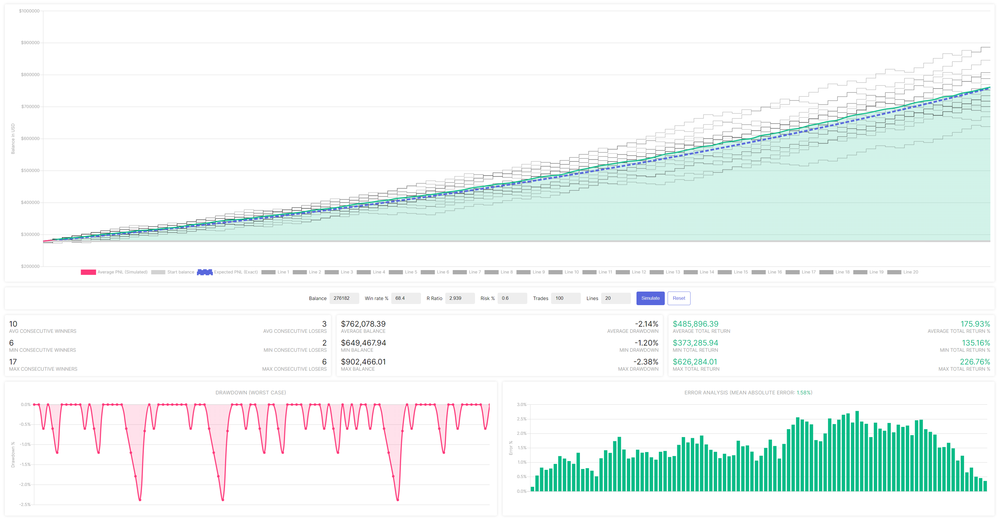

# Equity Simulator
Do you fully understand your trading strategy? How do average losing streaks look like for you? How likely is it that you are going to have losing streaks of lets say 10 trades?

With the equity simulator you can quickly find out by getting a deeper insight in your trading strategy. 
You can run a simulation of maximal 200 trades to see what your maximal, minimal and average drawdown is, 
how many trades you lose on average losing streaks and your possible future portfolio balance after 200 trades or less.

As traders, we all know how it feels to lose a few trades in a row- It makes you nerveous and can shift your mindset to a less positive one.
This is where the equity simulator can help you, as you can find out that losing x consecutive trades can be quite normal for your strategy.
Having an understanding of your trading strategy can help you achieve better discipline and better trading psychology. 
It can also help you find out where and mostly 'how' to improve. 

Play with the settings and you will get an understanding of the effect that different parameters have on your statistics. Do you need to focus more (or less) on your winrate, or could you improve your average risk:reward?

## Parameters
The equity simulator simulates data based on the following statistical parameters:
Your balance, Win rate, R Ratio and Risk % per trade.

There is a limit on the amount of trades capped to 200 and maximal 20 different simulation lines at the same time.
The 20 simulation lines are used to calculate the Maximal, Minimal and Average result. The thick green line on the chart is the average.

## Metrics
The table below summurises all the metrics that can be simulated by the equity simulator.

|Drawdown|Balance|Returns|
|--|--|--|
|Average consecutive winners|Average Balance|Average Total Return|
|Minimal consecutive winners|Minimal Balance|Minimal Total Return|
|Maximal consecutive winners|Maximal Balance|Maximal Total Return|

