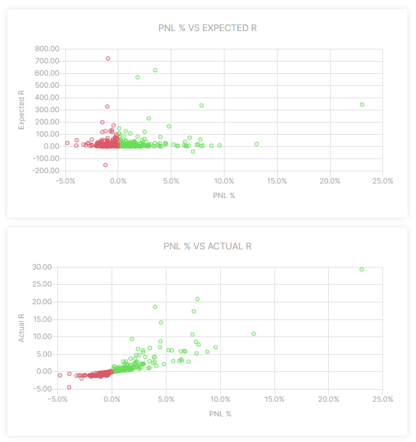

# Expected vs actual R

Do we have too high targets for our trades? or do we take often profit way before our initial target has been hit?
On the Risk Reward page, we can find a tool that gives us insight in our profit-taking process by comparing the expected R to the actual R of the trades.

