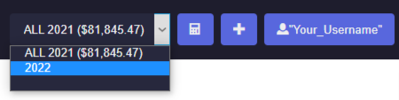

# TradeTracker.app
This document will help you to get started with the [TradeTracker app](https://beta.tradetracker.app) and start journaling your trades. We know that no one likes reading long documentation, so we will try to keep it as short as possible.

## Getting started

### Account creation
An account can be registered at [beta.tradetracker.app/register](https://beta.tradetracker.app/register). Once that's done, you can login to your account at [beta.tradetracker.app/login](https://beta.tradetracker.app/login).

### Overview of the UI
This screenshot below illustrates the different components. This is what you see after loggin in to the app.

Portfolio switch > Calculator > New Position > Account Settings

The theme can be changed to darkmode, using the button in the vertical menu.

### Demonstration
On the first login, an portfolio with demo trades will get generated to give a feeling of the possibilities and features the app provides.

## Getting ready
However, you want to start trading on an new, fresh, empty portfolio with a clean dashboard.

Once you're ready, here is how you set it up:

### Create a portfolio
Go to `Portfolios`, and [create a new portfolio](https://beta.tradetracker.app/portfolios#new) by clicking on the add button.

A new row will apppear:

After selecting an Exchange Platform by choice, the app recoginises the price-tickers from the markets available to trade on that exchange.
If your exchange is not listed, please contact us and we will add it as soon as possible.

Check if the default fee setting correspond with the fee tier based on your trading volume (exchanges give often discounts on fees when having $100,000 + monthly volume).

Fill in a target Risk%, so the position size calculator remembers how much risk you are willing to take.

After filling in the portfolio form, click on the save button on the right side.

### Switch to the portfolio
Switch the portfolio from the `demo` portfolio to the new one. This is done using the portfolio selector, in the top-right corner of the app.

You're now inside the portfolio, by having selected it with the switch.

### Create a new transaction
Every portfolio starts with a first transaction valued by the number of the capital that is sitting on your exchange and the amount you want to trade with. 
The purpose of doing this is because the value of your portfolio is used to calculate percentages and other values of the portfolio.

The process of creating a transaction is simple, just like creating a portfolio. Go to `Transactions`, and [add a transaction type deposit](https://beta.tradetracker.app/transactions#new) and fill in the number.

That's it, the portfolio is ready to be used!