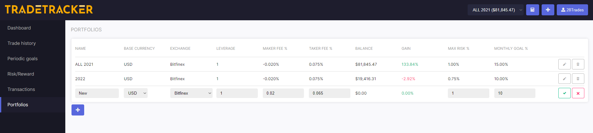

# Getting started

This document will help you to get started with the [TradeTracker app](https://beta.tradetracker.app), and start journaling your trades. We know that no one likes reading long documentation, so we will try to keep it as short as possible.

## Creating an account

First you will need an account. An account can be registered at [https://beta.tradetracker.app/register](https://beta.tradetracker.app/register). If you have registered, you will receive an invitation e-mail with a link that is used to set up your password. Once that's done, you can login to your account at [https://beta.tradetracker.app/login](https://beta.tradetracker.app/login).

## Overview of the UI

Once you have logged in, you will be faced with the following UI. The illustration belows gives a quick description of the different components.

## First steps

When your account is created, we also create a demo portfolio with some data for you. However, you obviously want to start with a new dashboard. Here's how.

### Create a new portfolio

Go to `Portfolios`, and [create a new portfolio](https://beta.tradetracker.app/portfolios#new).

Select the exchange you are using, and check if it correspons with your fee. If your exchange is not listed, please contact us and we will add it as soon as possible! This is used to get the data from the live ticker, so you could also select another exchange (if it has your symbols).

### Switch portfolio

You should now switch your the newly created portfolio. This can be done with the portfolio selector, in the top right corner.

Once you have switched to your new portfolio, you can remove the demo portfolio.

### Create a new transaction

Every portfolio starts with initial capital. You can add initial capital to the portfolio by creating a new transaction. Go to `Transactions`, and [add a new deposit](https://beta.tradetracker.app/transactions#new).

That's it, you can now start journaling!

