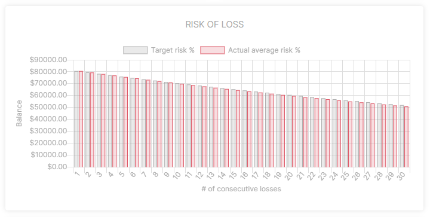

# Risk of loss

## Introduction
Quickly see what the impact is of taking too much risk. It shows how quickly balance drains after x amount of consecutive losses.

### Compare
Compare target risk% of the portfolio to the actual risk% of the trade history, as a reminder of how important it is to manage your risk.
Risk% is defined as the percentage of the portfolio balance that will be lost after a losing trade. 

An example: when a trade is taken with 2% risk, the portfolio will lose 2% of it's value from that moment.

### Settings
Play with the settings to see what effect it has on the drawdown.

### Gain to breakeven
What is worthwhile to note: A drawdown of 50% requires a 100% gain to breakeven. As the drawdown gets worse, it requires an even much bigger gain to reach the point of breakeven.

|Percentage loss|Percentage to breakeven||Percentage loss|Percentage to breakeven|
|--|--|--|--|--|
|5%|5.3%||55%|122.2%|
|10%|11.1%||60%|150%|
|15%|17.6%||65%|185.7%|
|20%|25%||70%|233.3%|
|25%|33.3%||75%|300%|
|30%|42.9%||80%|400%|
|35%|53.8%||85%|566.7%|
|40%|66.7%||90%|900%|
|50%|100%||95%|1900%|