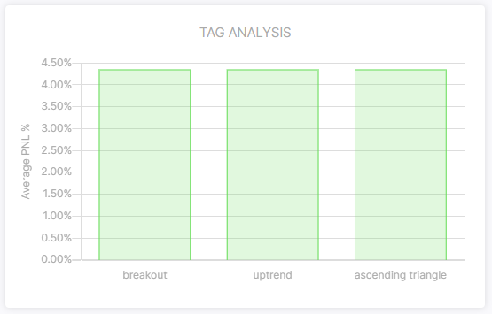

# Tags

Tags will help you to categorize your trades based on certain labels.
You can use these categorizations to see which tags are profitable, and which are not.
This will help you to identify which strategies/patterns/mistakes yield your biggest losses. Likewise it will show you what is profitable, so you can focus on that more.

Because the tags are used in charts, and other parts of the UI, the maximum length of a tag is fixed to 26 characters.

## Managing tags

Tags can be added to a trade on the trade set up page. Simply enter a name for a tag, and press enter.
It is also possible to add multiple tags if you seperated them with a comma `,`.

You can remove a tag by click on it. Don't forget to save the data!

## Analytics

The dashboard has a chart which shows the average P/L for each tag.
You can use this to find out which tag is the most profitable, and which are not.

## Ideas

Tags are universably applicable, so to get you started, here are a few ideas which you can use as tags:

 * Use patterns such as `ascending triangle`, `double top`, `rising wedge`.
 * Use elliot wave names such as `impulse`, `flat`, `zigzag`.
 * Use your mistakes as tags such as `no plan`, `no stoploss`, `closed too early`.

Of course you can use anything as a tag, and we hope that we have inspired you with ideas to use them.