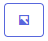

# Trade History
Table of the trade history from the selected portfolio.

### Tradingview chart
It is possible to add a tradingview chart to a trade. When a tradingview chart is available, the following icon will be displayed in the trade history table.

By clicking on the icon, your browser will oppen the tradingview chart in a separate tab.

* **Trade History page:** 1 easy click away from opening your tradingview chart! 