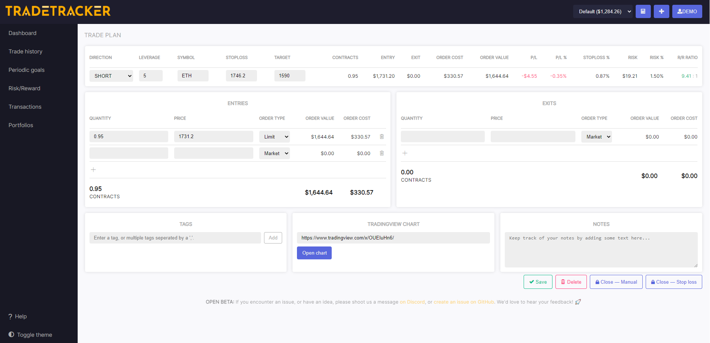

# Trade Setup Page
The trade setup page is a 

On the top left of the trade setup page you're supposed to type in the Direction, Leverage, Symbol, Stoploss and Target at first.

Our Trade Setup Page has the following variables that you can change:

|Variable|Description|
|--|--|
|Direction|The direction of the trade, either `LONG` or `SHORT`.|
|Leverage|Leverage is retrieved from your portfolio settings, or filled in manually.|
|Stop loss|Price at which the position should be exited.|
|Target|Price at which you intent to sell your position.|

Based on the provided variables, the following values are calculated:

|Variable|Description|
|--|--|
|Stop loss%| How low your stop loss price is in percentages based on your entry price.|
|Target %|How high your target price is in percentages based on your entry price.|
|Value at risk| How much of your balance is at risk if your stop loss is hit.|
|fee|Total fee that is paid for exiting your position with a stop loss. Fee calculated with a market order.|
|Order cost|The value of your order divided by leverage, plus fee.|
|Order value|The value of your order, without fees.|

