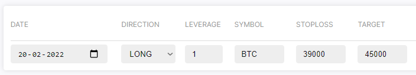
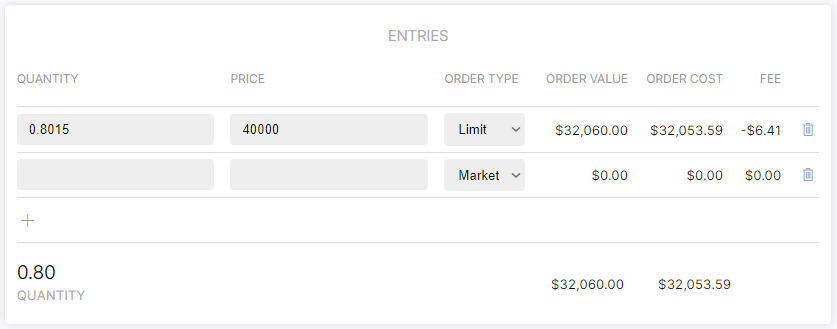
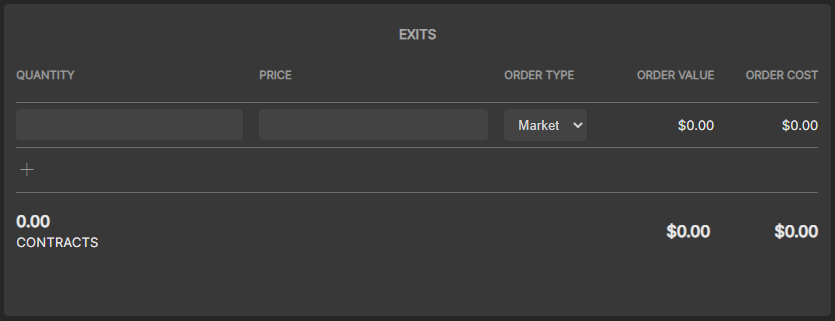

# Trade Setup Page
The trade setup page is a 

Based on the provided variables (below), the following values are calculated:

|Variable|Description|
|--|--|
|Stop loss%| How low your stop loss price is in percentages based on your entry price.|
|Target %|How high your target price is in percentages based on your entry price.|
|Value at risk| How much of your balance is at risk if your stop loss is hit.|
|fee|Total fee that is paid for exiting your position with a stop loss or exit price. Fee calculated with a market order.|
|Order cost|The value of your order divided by leverage, plus fee.|
|Order value|The value of your order, without fees.|

On the top left of the trade setup page you're supposed to type in the Direction, Leverage, Symbol, Stoploss and Target at first.

## Main values

Main variables for your trade that you can change:

|Variable|Description|
|--|--|
|Direction|The direction of the trade, either `LONG` or `SHORT`.|
|Leverage|Leverage is retrieved from your portfolio settings, or filled in manually.|
|Stop loss|Price at which the position should be exited.|
|Target|Price at which you intent to sell your position.|

## Entry form

Entry variables for your trade that you can change:

|Variable|Description|
|--|--|
|Quantity|The amount of stock you're buying.|
|Price|The prijs of which you bought the stock.|

## Exit form

Exit variables for your trade that you can change:

|Variable|Description|
|--|--|
|Quantity|The amount of stock you're selling.|
|Price|The prijs of which you sold the stock.|

