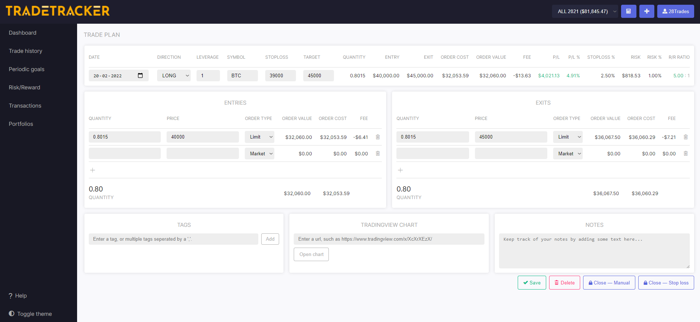
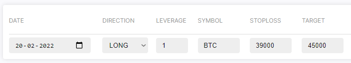
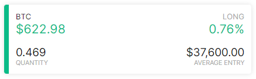
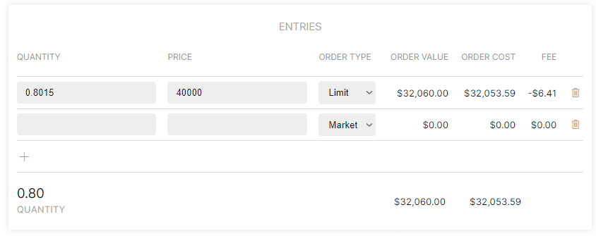
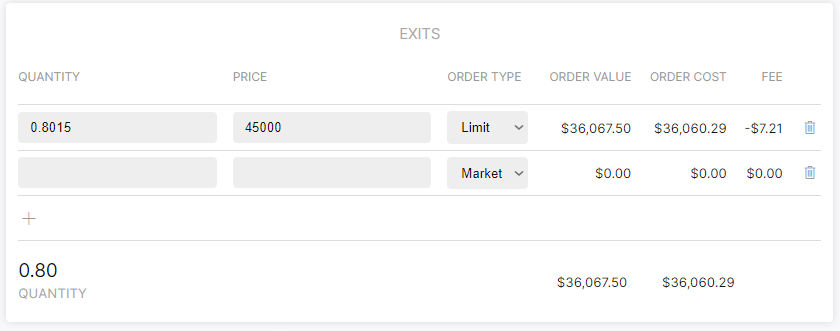
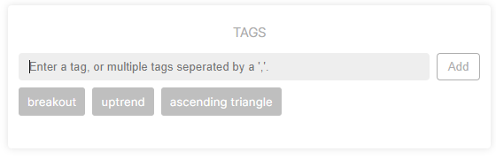
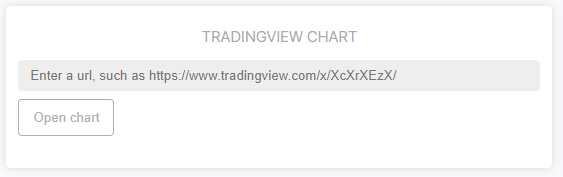
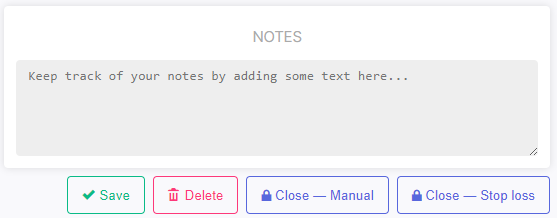
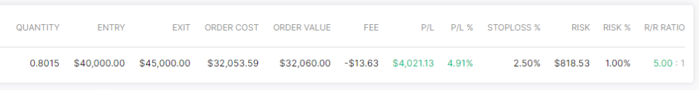
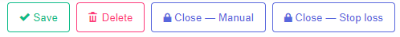

# Trade Setup Page
Screenshot of the trade setup page.

### Main variables

|Variable|Description|
|--|--|
|Direction|The direction of the trade, either `LONG` or `SHORT`.|
|Leverage|Leverage is retrieved from your portfolio settings, or filled in manually.|
|Symbol|The symbol of the market.|
|Stop loss|Price at which the position should be exited at a loss.|
|Target|Price at which you intent to cover the position.|

When the symbol of the market is filled in correctly, live P/L will be shown in the trade setup page as well as on top of the dashboard:

### Entry form

|Variable|Description|
|--|--|
|Quantity|Size of shares|
|Price|Price of shares|
|Order type|`limit` or `market` order, which often differ in fee's.|

### Exit form

|Variable|Description|
|--|--|
|Quantity|Size of shares|
|Price|Price of shares|
|Order type|`limit` or `market` order, which often differ in fee's.|

### Tags
Tags will help you to categorize your trades based on certain labels.
You can use these categorizations to see which tags are profitable, and which are not.
This will help you to identify which strategies/patterns/mistakes yield your biggest losses. Likewise it will show you what is profitable, so you can focus on that more.

Because the tags are used in charts, and other parts of the UI, the maximum length of a tag is fixed to 26 characters.
You can find more about tags on [the tags documentation page.](https://docs.tradetracker.app/tags/)

### Tradingview Chart
You can paste the link of your tradingview chart here for later reference. After closing the trade you can find this back easily to click on the 'picture icon' in the trade history and open the chart link in one click.

### Notes
If you like, you can even add notes to a trade.

### Calculations
Based on the provided variables (below), the following values are calculated:

|Variable|Description|
|--|--|
|Quantity|Total position size of the trade|
|Entry|Average entry|
|Exit|Average exit|
|Order cost|Position size in portfolio base-currency format plus paid fee's|
|Order value|Position size in portfolio base-currency format|
|Fee|Total of paid fee's|
|P/L|Profit/losss in portfolio base-currency format|
|P/L%|Profit/losss in percentage over the portfolio|
|stoploss%|Distance between entry and stoploss in percentage|
|Risk|Risk in base-currency format|
|Risk%|Risk in percentage over portfolio|
|R/R Ratio|Risk/Reward ratio|

### Saving and closing trades
Saving the trade happens automatically when leaving the trade setup page. (e.g switching to the Dashboard or an other page)
In order to parse a trade to the trade history, simply type in the exit form and press on the `Close - Manual` or `Close  Stop loss` button.

