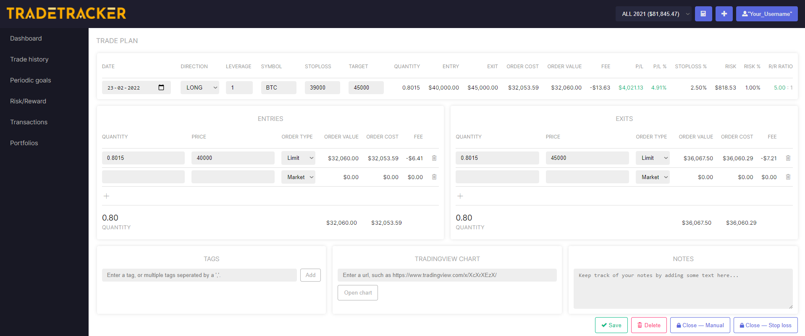
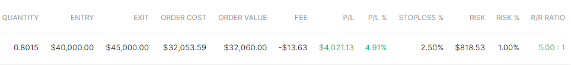
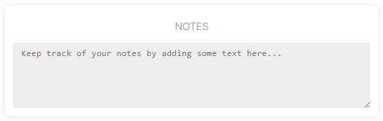

# Trade Setup Page

## Introduction

**This is what the trade setup page looks like.**

It can be found by clicking on the add position or while using the position size calculator.

* When using the position size calculator, it automatically forwards the `entry`, `stoploss` and `target` price, as well as using a `limit` or `market` order to the Trade Setup Page after clicking take trade.
More about our position size calculator [here](../calculator).

### Main variables

|Variable|Description|
|--|--|
|Direction|The direction of the trade, either `LONG` or `SHORT`.|
|Leverage|Leverage is retrieved from your portfolio settings, or filled in manually.|
|Symbol|The symbol of the market.|
|Stop loss|Price at which the position should be exited at a loss.|
|Target|Price at which you intent to cover the position.|

* **Open positions: ** 
When the symbol of the market is filled in accordingly, live P/L will be shown in the trade setup page as well as on top of the dashboard.

 
*Dashboard card of an open position.*

### Entry form

|Variable|Description|
|--|--|
|Quantity|Size of shares|
|Price|Price of shares|
|Order type|`limit` or `market` order, which often differ in fee's.|

### Exit form

|Variable|Description|
|--|--|
|Quantity|Size of shares|
|Price|Price of shares|
|Order type|`limit` or `market` order, which often differ in fee's.|

### Calculations
Based on the variables that were typed in, the following values are calculated:

|Variable|Description|
|--|--|
|Quantity|Total position size of the trade|
|Entry|Average entry|
|Exit|Average exit|
|Order cost|Position size in portfolio base-currency format plus paid fee's|
|Order value|Position size in portfolio base-currency format|
|Fee|Total of paid fee's|
|P/L|Profit/losss in portfolio base-currency format|
|P/L%|Profit/losss in percentage over the portfolio|
|stoploss%|Distance between entry and stoploss in percentage|
|Risk|Risk in base-currency format|
|Risk%|Risk in percentage over portfolio|
|R/R Ratio|Risk/Reward ratio|

### Save and closing trades
In order to close a trade and send it to the trade history, simply type in the exit form and press the `Close - Manual` or `Close  Stop loss` button.

* Saving the trade also happens automatically when leaving the trade setup page (e.g switching to the Dashboard or an other page).

## Additionals
Besides the statistics of your trade, like the data described above, there are also other metrics that can be given to a trade:

### Tags
Tags will help to categorize trades based on specific labels.
Categorize the trades with tags to see which category tags are profitable to trade and which ones are not. 
It helps identify which strategies, patterns or mistakes yield the biggest wins or losses.

* Because the tags are used in dashboard graphs and other parts of the UI, the maximum length of a tag is fixed to 26 characters.
You can find more about tags on [the tags documentation page.](../tags)

### Tradingview Chart
You can paste the link of your tradingview chart here for later reference.

* **Trade History:** 1 easy click away from opening your tradingview chart! 

### Notes
If you like, you can even add notes to a trade.

